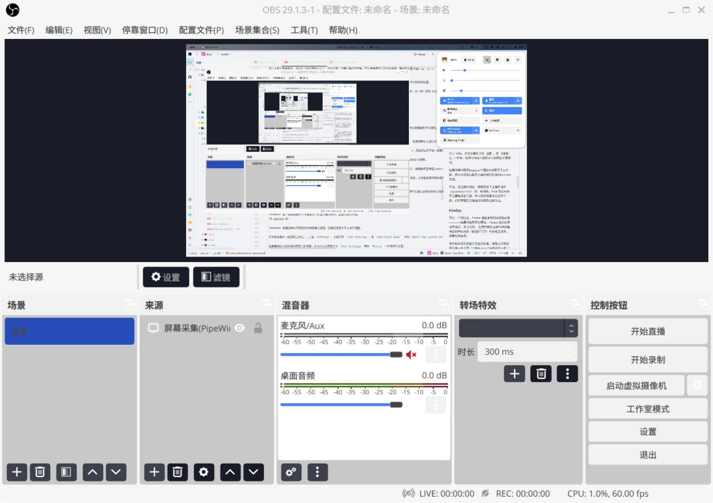


虽然标题是“在 GNOME 上实现可自定义主题的自动切换深色模式”，但是本文所述的方法也有可能可以用于其它桌面环境。（如对于特定应用的设置等等）

<br>

本文所述的方法不为 GNOME 官方所支持，甚至可能会未来的版本中失效，所以请谨慎使用。

<br>

本文所述的方法需要对系统进行一定的修改，如果你不知道自己在做什么，请不要使用本文所述的方法。同时请做好对原有配置的备份，以防万一。


# 更新日志

- 2023.07.22 初稿
- 2023.09.03 新增有关 Auto Dark Mode 插件的更新

前一阵子，我把我的laptop重装成了 [Arch Linux](https://archlinux.org/)，并且使用了 [GNOME](https://gnome.org) 作为桌面环境，但是我发现它并没有像 macOS 那样自动切换深色模式，于是我就开始寻找方法来实现这个功能。

经过多日的摸索，我终于找到了一种比较完全的切换深色模式的方法，而且还可以随时间自动切换，支持自定义主题，并[把大致思路分享在联邦宇宙上](https://nya.one/notes/9hah8g2lry)，下面展开说说。

# 难点

要先说自动切换深色模式，我们先来说 GNOME 上的预配的深色模式的一些问题。

GNOME 上的确是有 “深色模式” 的，但是它只支持 GNOME 预配的 Adwaita-dark 主题，如果你是默认主题的忠实用户，这应该是一件好事——它基本上支持所有的平台构建的应用（对应的Qt主题可能需要另行安装，详见[Uniform look for Qt and GTK applications - ArchWiki#Adwaita](https://wiki.archlinux.org/title/Uniform_look_for_Qt_and_GTK_applications#Styles_for_both_Qt_and_GTK)）。但是这对于想要自定义主题的用户来讲，就不是那么友好了。

而当通过 `User Themes` 这个预装扩展使用自定义主题后，还会发现一个问题：主题明明是支持 GTK4 的，但是应用后，一些 GTK4 应用（比如 GNOME 在被安装时自带的一些应用）却没有切换到主题的样式，仍使用默认的adwaita主题。而且这种办法，对于很大一部分 Qt 应用和 Electron 应用，它是无能为力的。

至于GTK4应用没有跟随主题的的原因，GNOME 官方博客的 [The Truth they are not telling you about “Themes” – Rust in Peace](https://blogs.gnome.org/alatiera/2021/09/18/the-truth-they-are-not-telling-you-about-themes/) 文章已经有所解释，便不在此赘述。

并且，这种办法对于安装的 Flatpak 应用也是无效的，因为它们在一个与主系统相对隔离的沙盒环境中运行，你所安装和应用的主题并不会为其所读取。

Qt 则更不必想，由于主题系统独立于GTK，所以自定义主题，甚至于深色主题都是不会被使用Qt作为界面构建的应用所使用，也就是说在不进行任何配置的情况下，Qt 应用是不会跟随系统主题的。

~~所以这就是为什么说 GNOME 坑很大，不如去用Plasma~~

然后就是自动切换的问题了，很明显，就像大多数桌面环境一样，GNOME 并没有提供自动切换深色模式的功能，所以我们需要自己动手。

# 解决办法

通过以上我们不难看出，要解决这个看似简单的问题，我们需要先行解决以下几个问题：

1. 如何为GTK4应用使用自定义主题？
2. 如何让使用系统界面组件的flatpak应用读取到系统当前主题？
3. 如何让Qt应用跟随系统主题？
4. 如何使系统在切换深浅色模式时使用自定义主题？
幸运的是，这些问题都有解决办法。

不过，先不要着急去解决这些特殊环境下的问题，我们先来解决最基本的问题：如何让系统自动切换深浅色模式，而且使用自定义主题？

## 先行准备

在开始配置之前，我们需要提前准备一些东西：

首先，我们需要安装一个叫做 [Night Theme Switcher](https://extensions.gnome.org/extension/2236/night-theme-switcher/) 的扩展，它可以让我们在指定的时间（或者是随日出日落）自动切换深浅色模式，而且可以自定义主题。

不知道如何安装 GNOME Shell 扩展？请参考 [How to Use GNOME Shell Extensions](https://itsfoss.com/gnome-shell-extensions/#method-2-install-gnome-shell-extensions-from-a-web-browser)。

（注：你可能需要根据自己所使用的发行版而调整步骤，如果觉得不靠谱这个东西网上搜一搜就有了）


然后，我们需要找两套主题，一套是浅色为主的，一套是深色为主的（或者是同一套主题的深浅色版本），我这里使用的是 [vimix-gtk-theme](https://www.gnome-look.org/p/1013698)（用于浅色模式下）和 [Nordic](https://www.gnome-look.org/p/1267246)（用于深色模式下）作为示例。

但是无论如何，主题需要满足以下条件：

- 支持 GTK4
- 最好有对应的 kvantum 主题
- 符合自己的心意

找到了主题之后，我们需要把它们下载到 `~/.themes` 目录下，如果没有这个目录，就自己创建一个。

如果可以，还可以找一些对应的图标主题和光标主题，这样就可以让你的桌面环境更加统一。有余力的话，还可以为你所使用的应用找一些对应的样式主题。

当然，还需要安装 kvantum，可以参考 [Kvantum 项目的 README.md来进行安装](https://github.com/tsujan/Kvantum/tree/master/Kvantum)

## 配置


比较喜欢默认的 Adwaita 样式？你可以直接跳转到 [对于Adwaita的设置](#对于adwaita的设置)。


### Night Theme Switcher 配置

一般来说，这个扩展在默认安装时就已经被启用，但是我们还是需要对其进行一些配置。

打开扩展的设置，你会看到这样的界面：


在默认打开的 `安排` 一栏，可以自由调整切换发生的时间，或者是关闭手动安排，使其随日出日落自动切换。


如果想要在日出日落前后一段时间内切换，还需要允许扩展访问位置信息。否则扩展无法获取到日出日落的时间，并自动切换回手动安排。

设置方法：打开`设置`应用，在 `隐私` 一栏中，找到 `位置信息`，并将`定位服务`的开关开启。


`背景` 一栏可以分别设置深色和浅色模式下的背景，这里不再赘述。

`命令` 一栏可以设置切换时执行的命令，这里我们过会儿要设置两套命令，不过先不要着急，我们先往下看。

`主题` 一栏可以设置切换要切换哪些元素的主题，以及要切换的主题，你可以根据需要进行调整。一般来说，只需要开启并调整 `GTK主题` 和 `图标主题` 两项即可。

### GTK4 的额外配置

前面说到，`Night Theme Switcher` 可以在切换时执行命令，我们就可以利用这个功能来解决 GTK4 应用不跟随主题的问题。

GTK 4 的主题实际上也是一些 CSS 文件，不过与 GTK 2/3 不同的是，GNOME 并没有提供设置自定义主题的方式，所以我们需要自己动手替换原有的样式。

在网络搜索这个问题的解决办法时，我找到了 [odziom91/libadwaita-theme-changer](https://github.com/odziom91/libadwaita-theme-changer) 这个项目，它可以让我们替换 GTK4 应用的主题，而且还可以使用自定义主题。

简单浏览了一下源码，我们不难发现：这个脚本是通过将原有的 GTK4 配置目录下 gtk.css 替换为主题内建的对应文件来实现的，而且我们也知道了这个文件的对应路径：`~/.config/gtk-4.0/gtk.css`。

那么我们只需要把这个脚本所做的事情用shell脚本改写一下，再在扩展中进行配置，就可以实现自动切换 GTK4 主题了。

以下是以 `vimix-light-doder` 主题（`vimix-gtk-theme`的其中一个样式）为例，编写的相应的脚本，你可以根据需要修改它：

```shell
cp $HOME/.themes/vimix-light-doder/gtk-4.0/assets/* $HOME/.config/gtk-4.0/assets/
ln -s $HOME/.themes/vimix-light-doder/gtk-4.0/gtk.css $HOME/.config/gtk-4.0/gtk.css
```

你可以亲自执行一次这个脚本，再打开一个 GTK4 应用（比如设置）看看是否能够正常切换主题。（已经打开的应用需要重启才能看到效果）


有些主题会把 `assets` 目录放到 gtk.css 所在的上一级目录，或者是其它位置，这个时候可能就需要对CSS文件做一点修改。

使用你所喜爱的编辑器，打开主题当中的 gtk.css 文件，查找 `assets` ，如果找到的路径不是 `./assets` ，那么就需要修改脚本中的路径为其所对应的路径，而且还要将CSS文件中所有的 `assets` 对应的路径改为 `./assets`。

这么做的原因是，GTK4 的主题文件中，所有的资源文件都是相对于 gtk.css 所在的路径的，而我们的脚本是将 gtk.css 放在了 `~/.config/gtk-4.0` 目录下，所以需要将所有的资源文件的路径改为相对于 `~/.config/gtk-4.0` 的路径。

举个例子，我所用的 Nordic 主题将 assets 目录放在了 gtk.css 所在的上一级目录（也就是主题的根目录），那么脚本就需要改为这样：

```shell
cp $HOME/.themes/Nordic-[variant]/assets/* $HOME/.config/gtk-4.0/assets/
ln -s $HOME/.themes/Nordic-[variant]/gtk-4.0/gtk.css $HOME/.config/gtk-4.0/gtk.css
```

并且 `gtk.css` 中所有的 `../assets` 都需要改为 `./assets`。


如果你觉得直接将上面的一串复制进扩展的输入框中不方便后续编辑，可以将其写入到一个shell文件中，然后在扩展中填写执行对应的文件的脚本。

比如，我们将上面的脚本作为切换浅色主题的脚本写入到了 `~/.local/bin/light-theme-switcher.sh` 中，那么就在扩展中的命令菜单的`日出`一栏填写 `sh ~/.local/bin/light-theme-switcher.sh`即可。

## Qt 的额外配置

Qt 的主题系统与 GTK 的主题系统是相互独立的，所以我们需要单独为 Qt 应用设置主题。

在前面的步骤中，你应该安装了 kvantum，它可以让我们为 Qt 应用设置主题，而你可能不知道的是，它也拥有一系列的命令行参数，可以让我们在不打开设置界面的情况下，直接设置主题。

不过先别急着尝试，因为我们还没有让 Qt 应用使用 kvantum 主题。先行添加以下的环境变量：

```env
QT_STYLE_OVERRIDE=kvantum
```


有关如何设置环境变量，请参考 [ArchWiki - Environment variables](https://wiki.archlinux.org/title/Environment_variables#Defining_variables)。


然后注销并重新登录（亦或重启，取决于你设置的环境变量范围），先打开 Kvantum Manager，选择一个你喜欢的主题，然后点击 `Apply` 按钮，再打开一个 Qt 应用，看看是否能够正常使用主题。


不知道如何安装自己想要的 kvantum 主题？试试把主题包解压，然后在 Kvantum Manager 中点击 `Install Theme` 按钮，选择解压后的主题文件夹，再点击 `Apply` 按钮即可。


这样虽然可以让 Qt 应用使用 kvantum 主题，但是这种办法还需要打开 Kvantum Manager 才能切换主题，并不便于自动切换，这时我们就需要使用它的命令行参数了。

要使用它的命令行工具切换主题：

```shell
kvantummanager --set [THEME]
```

其中 [THEME] 为你想要使用的主题的名称，在 Kvantum Manager 中“变更主题”处可以找到（一般带有 `Kv` 标识）。

比如，要使用内置的类似于Adwaita样式的主题 `KvGNOME`，我们可以这样写：

```shell
kvantummanager --set KvGNOME
```

更改应当会立即生效。

剩下要做的，就是将这个命令写入到上面所创建的脚本中，然后在扩展中配置即可。（如果你在上个步骤中直接将命令复制过去的话，再以'&&'的方式附到扩展的相应命令中也可）

## 使用系统界面组件的 flatpak 应用的额外配置

前面说到，flatpak 应用是在一个与主系统相对隔离的沙盒环境中运行的，所以我们需要让它们读取到系统当前的主题。

这里的配置相对简单，只需要运行一次以下命令，将用户主题目录和gtk-4.0配置目录开放给flatpak应用访问即可。

```shell
flatpak --user override --filesystem=~/.config/gtk-4.0
flatpak --user override --filesystem=~/.themes
```


将系统中的目录开放给flatpak应用访问，可能会造成数据泄露，从而降低系统的安全性，所以请谨慎使用。


## 对于Adwaita的设置

考虑到很多人出于兼容性等等的原因可能会使用默认的 Adwaita 主题，所以这里也给出一些对于 Adwaita 主题的设置。


此部分内容在Ubuntu 23.04上测试通过，其它发行版可能会略有差异。


Adwaita 作为默认主题，毫无疑问的是它的兼容性是最好的，它支持 GTK4，也支持 Qt。但是，对于Qt应用来说，它在默认情况下并不会跟随系统的深色模式，所以仍需要我们手动设置。

对于 Qt 5 应用，我们可以直接设置环境变量 `QT_STYLE_OVERRIDE=adwaita`，这样会通过覆盖默认样式的方式让大部分的使用系统提供的Qt样式的Qt应用使用adwaita主题。

对于稍旧一些的使用Qt4作为界面构建的应用，我们可以使用 `qtconfig-qt4` 这个工具来设置。

或者，如果你有安装 kvantum 的话，可以使用 Kvantum Manager 来设置 `KvGNOME` 主题，它提供了类似于旧的 Adwaita 的样式。

### 自动切换

在最开始的步骤中，我们已经安装了 `Night Theme Switcher` 这个扩展，我们这次仍然使用它完成自动切换。

考虑到有一部分人是直接跳转过来的，我还是简单说一下怎么配置。

首先，我们需要在 `安排` 一栏中设置好切换深浅色的时间，或者关闭手动安排，使其随日出日落自动切换。（如果扩展提示无法获取到日出日落的时间，请转到设置，在 `隐私` 一栏中，找到 `位置信息`，并将`定位服务`的开关开启。）

如果你想要设置分别设置两种模式下的壁纸，可以在 `背景` 一栏中设置，这个由 GNOME （而不是插件）进行控制。

这样设置就基本完成了，其它的选项基本不用调整，当然，如果你偏好自订的图标样式，也可以在 `主题` 一栏中进行设置。

当然，由于 Adwaita 是支持 Qt 的，如果你想要让大部分的 Qt 应用也要跟随系统主题，可以安装 `qgnomeplatform-qt5` 和 `qgnomeplatform-qt6` 这两个包，然后设置环境变量 `QT_QPA_PLATFORMTHEME=gnome` 即可，这样避免了额外配置 Kvantum 和写脚本的麻烦。


有关如何设置环境变量，请参考 [ArchWiki - Environment variables](https://wiki.archlinux.org/title/Environment_variables#Defining_variables)。


## 善后工作

如果你按照上面的步骤进行了配置，那么你应该已经可以在深浅色模式之间自动切换了，但是，如果你想要在深浅色模式之间切换时，让所有的应用都使用自定义主题，那么你还需要做一些额外的工作。

对于大部分应用来说，进行以上的配置就可以了，但是总有一些特立独行的应用，它们使用着自己的主题系统，甚至在设置主题后变得混乱不堪（说的就是你OBS），对此需要做些额外的配置。

### KDE 系应用

这个范围比较广，因为 KDE 开发的大部分应用都使用Qt进行构建，但是它们并不会跟随系统主题，所以我们需要对它们进行额外的配置。

考虑到兼容性问题，我想大多数人并不会在 GNOME 上去安装 KDE 的应用，但是实际情况中，我们可能不得不需要使用到一些 KDE 应用（比如 Krita 和 Kate 等等），这就使事情变得比较复杂。

这里以 Krita 为例，其它是相类似的。

打开 Krita，点击菜单栏上的 `设置`，在 `界面颜色` 一栏中，选择与当前主题相对应的配色方案即可。

如果你通过配置kvantum主题的方式配置了Qt主题，那么你还能在配色方案中找到对应的kvantum主题。

不过，经过我的测试，即使安装了上面所述的 `qgnomeplatform` 的一系列包，Krita 等应用并不会跟随系统主题，所以还是需要手动设置主题，如果有需要还是建议以暗色主题为主。

### Firefox

作为一个浏览器，Firefox 遵循系统的深浅色设置————如果系统是深色模式，Firefox 就会使用深色模式，反之亦然。 在使用默认主题时浏览器自身的界面元素（标题栏等等）也会随之变化，界面较为协调。

但是假如你是自定义主题爱好者，或者只是比较喜欢某一套主题（比如Mozilla之前推出的一套[“凡人之声”的主题](https://blog.mozilla.org/en/products/firefox/firefox-news/independent-voices/)，很显然这并不是一套默认主题），你可能会因为在系统全局深色模式下看到一个刺眼的浅色的标题栏而感到不适。

不过好在，主题的切换也是能够通过浏览器扩展来实现的，你找到了 [automaticDark](https://addons.mozilla.org/en-US/firefox/addon/automatic-dark/) 这个扩展来实现定时切换自定义主题。

安装扩展后，你可以在扩展的选项中设置切换的条件（跟随系统、日出日落、手动设定时间），以及要切换的主题。（不过，跟随系统这点在Linux上表现并不太好，还是建议跟随日出日落或者手动设定时间）

当然，如果想要获得更为完美的体验，还可以搭配 [Darkreader] 这个扩展，它可以让网页的内容也跟随系统深色主题设置，让你在夜间阅读也能保护你的眼睛。（或者，也可以使用[midnight lizard](https://addons.mozilla.org/zh-CN/firefox/addon/midnight-lizard-quantum)，深入自定义网页的配色）

### OBS Studio

OBS 默认使用的 Yami 主题在自定义Qt主题下的显示效果并不好，甚至在浅色主题下会出现一些设置项看不清的情况，但可以通过更改为系统主题来解决，这样同时也会解决跟随系统主题的问题。



点击菜单栏上的`文件`，打开 `设置`，在 `通用` 一栏中，将 `主题` 的选项改为 `System` 即可。

### Telegram


Telegram 各个设置在使用不同语言包下的显示差异较大，这里以英文为准。


Telegram 桌面端默认不跟随系统深色模式设置，但是在设置中可以进行调整。

打开侧边菜单（就是那三条杠），点击 `Settings`，之后打开 `Chat Settings`，将 `Auto-night mode`  中的 `Match the system settings` 勾选即可。

如果要自定义对应颜色模式下的主题，可以在对应模式下在 `Chat Settings` 中的 `Themes` 一栏中进行设置。

### IntelliJ IDEs

虽然说写代码配合深色模式是最好的，但是吧考虑到总会有像我这样的~~异端~~人，喜欢在白天使用浅色模式，晚上使用深色模式，所以这里也给出一些设置办法。

众所周知，JetBrains 家的 IDE 在 Windows 和 macOS 下都是可以跟随系统颜色模式的，而且可以自订对应模式下所使用的主题。

反观 Linux 这边虽然系统 API 已经做的十分完善，但是 Jetbrains 很长时间了也没有作出适配（是说 [IDEA-251176](https://youtrack.jetbrains.com/issue/IDEA-251176/Implement-IDE-theme-sync-with-OS-on-Linux) 这类已经在三年前就已经提出来了，还是没有），~~难道是要给 Fleet 铺路？~~

不过，我们还是可以通过一些办法来实现自动切换主题的。

首先，我们需要安装一个叫做 [Day And Night](https://plugins.jetbrains.com/plugin/12006-day-and-night) 的插件，它可以让我们在 IDE 中设置定时自动切换主题。

插件启用后，我们可以在IDE的设置中找到 `Day And Night` 一栏，然后在 `Theme` 一栏中设置切换时间以及对应的主题即可。

此外，我还发现了一个叫做 [Auto Dark Mode](https://plugins.jetbrains.com/plugin/14076-auto-dark-mode) 的插件，它可以做到跟随系统设定去切换主题，最近更新支持了目前最新的 2023.2 版本。

在插件 Marketplace 搜索并安装这个插件，重启IDE，在设置中找到 `Auto Dark Mode` 即可调整相关设置。


对于 GNOME 42+ 用户，需要先行安装`xdg-desktop-portal-gnome`将插件设置中 `implement type` 设置为 `XDG-Desktop`，否则主题切换不起作用。同时，若其它选项不起作用（在深色模式下仍显示为浅色主题）时也可尝试此选项。

有关 XDG-Desktop 如何向第三方应用提供相关信息，可以查看 [XDG Desktop Portal - ArchWiki](https://wiki.archlinux.org/title/XDG_Desktop_Portal)。


### Fcitx5

GNOME 原生支持 `ibus`，但我还没有测试它的情况，只好拿出目前用的比较多的小企鹅输入法来说。

Fcitx5 的输入法主题很好配置，只需要打开 `Fcitx5 配置` 这个应用，点击 `附加组件`，点击 `经典用户界面` 旁的设置图标就可以配置主题。

如果要自定义当前的主题，我们可以点击主题旁边的设置图标，然后按照喜好来更改当前主题的设置。

但是找现成的主题明显更为便捷，而且有大量的配色方案可供挑选，要想找到一个心仪的主题，去 [GitHub](https://github.com/search?q=fcitx5-themes&type=repositories) 搜搜看或许是个不错的选择。

如果你找到了一个合适的主题，那么下载下来直接丢到 `~/.local/share/fcitx5/themes` 目录下就可以了。

然后就是自动切换的问题了，Fcitx5 本身并没有提供跟随系统颜色设置主题的功能，但是我们可以通过写脚本直接修改配置文件来实现。

Fcitx5 将所有的用户配置写进了一个配置文件里，想找到它们也不困难———打开 `~/.config/fcitx5`，你可以发现所有的配置文件都在这里。

翻找一下还能发现，`经典用户界面` 的设置存放在 `classicui.conf` 这个文件，那么思路就很明晰了：更改文件中主题相关的键值，然后在 `Night Theme Switcher` 中配置执行脚本即可。

直接使用文本编辑器打开 `classicui.conf`，我们发现我们设置的主题存放在 `Theme` 这个键值：

```conf
...
# 主题
Theme=catppuccin-mocha
...
```

那么我们只需要在切换深浅色模式时，使用脚本将这个键值改为相应的主题即可。

大致思路是 `grep` 查找 `Theme` 这一行，然后使用 `sed` 将其替换为我们想要的主题键值，最后将结果写入到原文件中。

我请 [Bard](https://bard.google.com) 帮我写了一个示例脚本，你可以根据需要进行修改：

```shell
#!/bin/bash

# Set the name of the config file
config_file="$HOME/.config/fcitx5/conf/classicui.conf"

# Get the old value of the setting
old_value=`grep -E "^Theme=" $config_file | cut -c 7-`

# Get the new value of the setting
new_value=$1

# Replace the old value with the new value
repl=`sed -i -e "s/$old_value/$new_value/" $config_file`

# Save the changes to the config file
echo "The value of setting_name has been changed to $new_value."
```

顺便说一句，如果要使用这个脚本，我们还需要一个主题名作为参数，而主题名就是在 `~/.local/share/fcitx5/themes` 存放的文件夹名字。

比如，我想要使用 `catppuccino-mocha` 这个深色调的主题，那么我就需要在扩展中的命令菜单的`日落`一栏填写 `sh ~/.local/bin/fcitx5-theme-switcher.sh catppuccino-mocha`。

`Night Theme Switcher` 用户请注意：

如果你在一个切换脚本中用到了这个脚本，请确保引用的路径是**绝对路径**，否则可能会出现找不到脚本文件的情况。


如果怕麻烦，我们可以直接使用 [Input Method Panel](https://extensions.gnome.org/extension/261/kimpanel/) 这个插件，它会让 KDE 的相关api兼容 GNOME，从而使其跟随 GNOME shell 的主题，不过缺点也在这儿，无法自定义主题（Fcitx5内相应选项也会失效，只能通过更换GNOME的主题来进行更换）。

### 其它较为通用的解决方案


以下内容部分由AI所生成，并不保证可用性。

如果应用并不在以上列表中，可以尝试以下的解决方案：

- 在应用的设置中查找是否有设置界面主题跟随系统的选项，如果有，就直接设置即可。（大概会在 `外观` 或者 `界面` 一类的设置中）
- 使用第三方的工具修改样式
- 如果有开发者的联系方式，直接和开发者联系，请求添加对应的功能
- 如果实在不行，就寻找功能相近的替代品，或者忍一忍吧

# 总结

以上便是我总结出来的一套比较全面的随日出日落切换深浅色主题的解决方案。

但是上面说到的办法并不是唯一的，也不一定是最友好的，就比如我在写这篇总结性经验的时候找到了一个 [Yin-Yang](https://github.com/oskarsh/Yin-Yang) 的项目，而且做的比较完备，希望大家也可以试试。

哦对了，我把上面所提到的所有项目都放在一个仓库里了，你可以直接在 [GitHub](https://github.com/BlockG-ws/autodark-for-gnome) 或者 [Codeberg](https://codeberg.org/grassblock/gnome-auto-dark) 上找到它，也希望大家在上面分享自己的经验办法。

后期可能会看需求做成单独的文档站，这样可以更方便的寻找对应办法，不过现在就先这样吧。

最后，感谢你能看到这里，希望这篇文章能够帮助到你。
